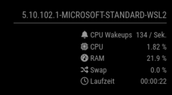

# MMM-FF-proces-stats

This [MagicMirror²](https://github.com/MichMich/MagicMirror) module shows statistics about the electron process.

## Installation

Navigate into your MagicMirror's `modules` folder and clone:

```sh
git clone https://github.com/shin10/MMM-FF-process-stats
```

## Configuration

To use this module, add it to the modules array in the `config/config.js` file:

```javascript
modules: [
  {
    module: "MMM-FF-process-stats",
    position: "bottom_right",
    config: {
      updateInterval: 1000,
      animationSpeed: 0
    }
  }
];
```

## Configuration options

The following properties can be configured:

| Option           | Default             | Expected     | Description                                   |
| ---------------- | ------------------- | ------------ | --------------------------------------------- |
| `updateInterval` | `1000` (1 second)   | `int`        | The delay before updating in milliseconds.    |
| `animationSpeed` | `0` (no transition) | `0` - `5000` | Speed of the update animation. (Milliseconds) |
